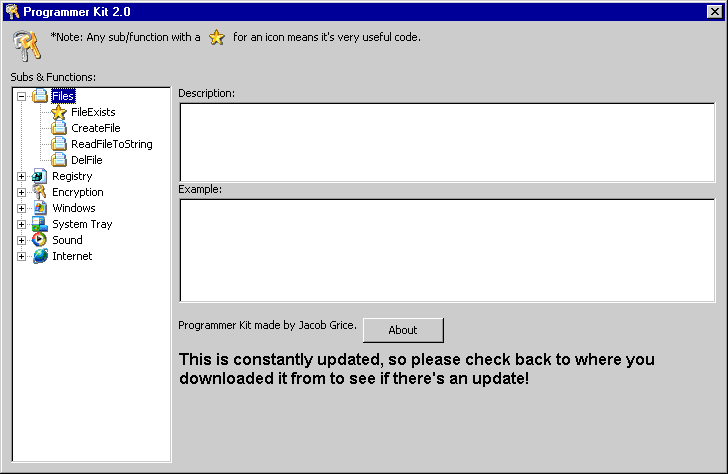



## Awesome Programmer Kit 2\.0 \(Updated\!\)

### Description

This is version 2.0 of the best tool a programmer needs for making good software! It has tons of great subs/functions! Recently added - internet functions, sound functions!
 
### More Info
 

             |
---                |---
**Submitted On**   |2002-05-19 06:33:28
**By**             |[I Like French Toast](https://github.com/Planet-Source-Code/PSCIndex/blob/master/ByAuthor/i-like-french-toast.md)
**Level**          |Advanced
**User Rating**    |4.8 (92 globes from 19 users)
**Compatibility**  |VB 5\.0, VB 6\.0
**Category**       |[Miscellaneous](https://github.com/Planet-Source-Code/PSCIndex/blob/master/ByCategory/miscellaneous__1-1.md)
**World**          |[Visual Basic](https://github.com/Planet-Source-Code/PSCIndex/blob/master/ByWorld/visual-basic.md)
**Archive File**   |[Awesome\_Pr848145192002\.zip](https://github.com/Planet-Source-Code/i-like-french-toast-awesome-programmer-kit-2-0-updated__1-34920/archive/master.zip)

### Source Code

<b>This is version 2.0 of the best tool a programmer needs for making good software! It has tons of great subs/functions! Recently added - internet functions, sound functions!By the way, please rate the code and leave feedback! Thanks!  Oh, and please post feedback on stuff you would want in the next version.</b>  
<h1>Super Cool Icons</h1>  
Want those <b>great icons</b> that you see in the screenshot plus about <b>110</b> more <b>neat</b> icons <b>in <big>three</big> different sizes</b>? Download them here:  
<a href="http://www.freecoolpages.com/thehangout/specware/Small (16x16).zip">Small (16x16)</a> - 84kb 
<a href="http://www.freecoolpages.com/thehangout/specware/Medium (32x32).zip">Medium (32x32)</a> - 140kb 
<a href="http://www.freecoolpages.com/thehangout/specware/Large (48x48).zip">Large (48x48)</a> - 176kb  
<a href="http://www.planetsourcecode.com/vb/scripts/ShowZip.asp?lngWId=1&lngCodeId=34920&strZipAccessCode=weso349201451">Programmer Kit</a> (Does not include icons exept for the ones used in it.)  
<h3>Remember! Rate + Leave Comments!!!</h3>

